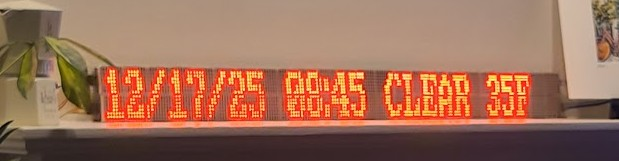
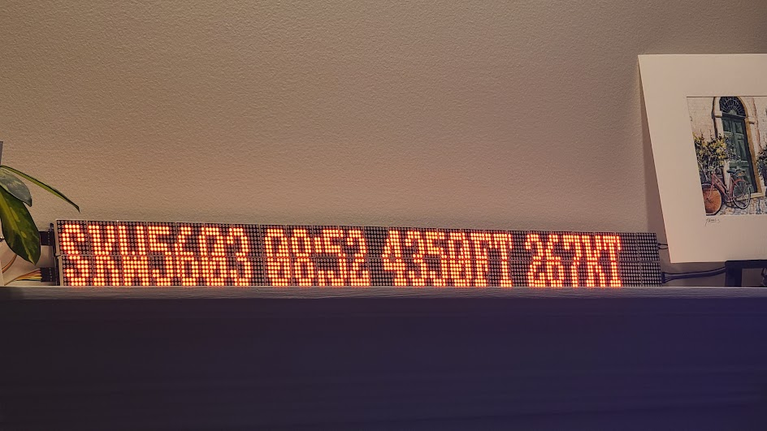
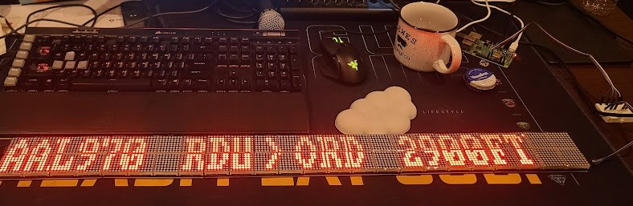

This is the flight tracker!
The main script, tracker.py, also uses led_display.py as I wanted to seperate the tracking logic from the display logic.
This can all be run locally without all the hardware.

SETUP:
Be sure to populate the API information in the credentials.json. (OpenSky, Aero, and Weather.com)
OpenSky credentials took a bit of time to work, don't be discouraged if it does not immediatly work.
Install Python and relevent libraries (Haversine, luma core)
  Just squash bugs as they appear and you'll be fine.

(WIN) LOCALLY RUNS THE APPLICATION (CMD in folder):
.\venv\Scripts\activate
python tracker.py
or any of the other .py scripts included

(PI) LOCALLY RUNS THE APPLICATION (Terminal in folder):
source venv/bin/activate
python tracker.py
or any of the other .py scripts included

You can mess with the setting in the config.ini. I believe the LED dimmesions are hard-coded.

Example of a 24x2 LED matrix powered by a 5V 4A power supply with a Raspberry Pi 3 B+ (seperately powered).

Flight not found.

Flight found outside operational window or without scheduling budget.

Flight found within operational window and with scheduling budget.

